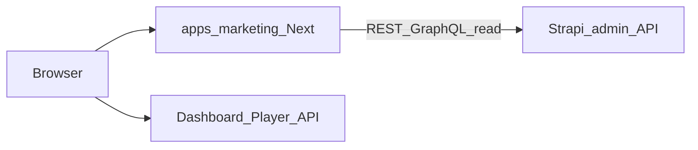

# Optional: Strapi CMS + public marketing site

The SaaS apps (`dashboard`, `player`, `backend`) do **not** embed Strapi. For a marketing website (landing, blog, legal pages) you can run Strapi separately and consume it from the lightweight Next app in `apps/marketing` (or any frontend).

## Recommended architecture

1. Deploy **Strapi** (Node + Postgres dedicated to CMS).
2. Create content-types: `Page` (slug, blocks), `BlogPost`, `LegalPage`, `SiteSettings` (SEO, nav).
3. Use **public read-only** API tokens in the marketing Next app (server-side `fetch` only — never expose admin tokens).
4. Point DNS: `www.` → marketing; `app.` → dashboard; `api.` → Nest.

## Alternative without Strapi

Ship `apps/marketing` as static/MDX pages only (no CMS). Fastest path to “legal + pricing” pages.

## Local development

- Strapi: `npx create-strapi@latest` in a separate folder or repo; run on port 1337.
- Marketing: `npm run dev -w apps/marketing` (port 3010) and set `STRAPI_URL` when you wire `fetch` in that app.
